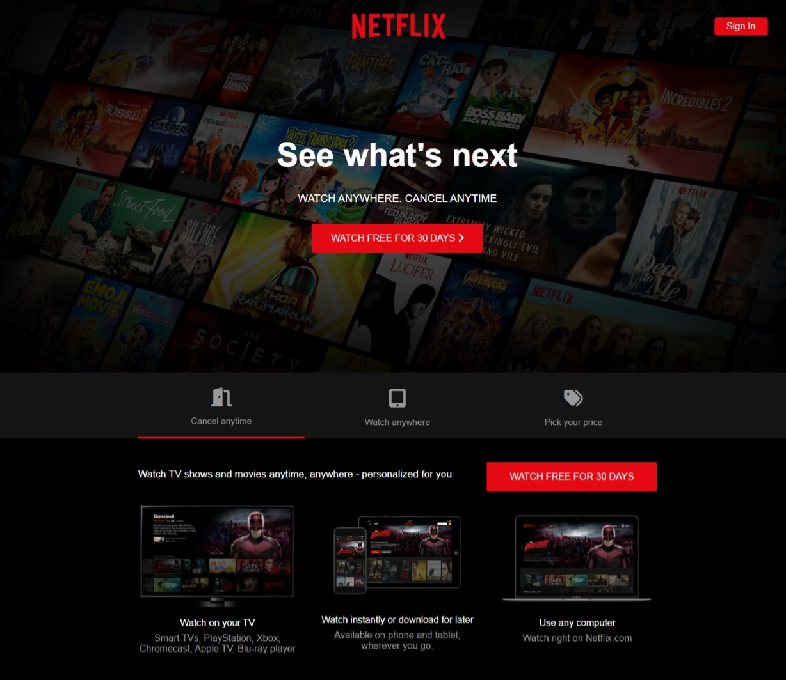
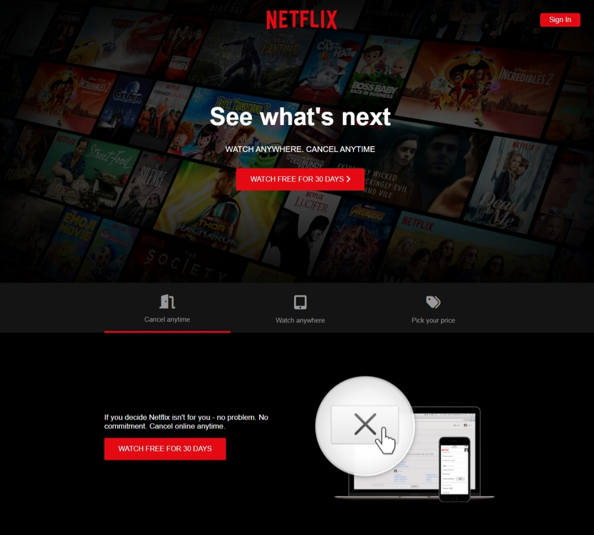
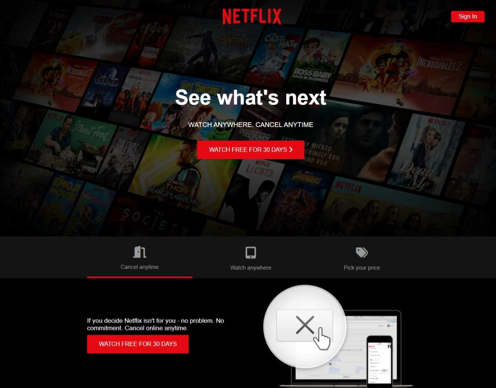
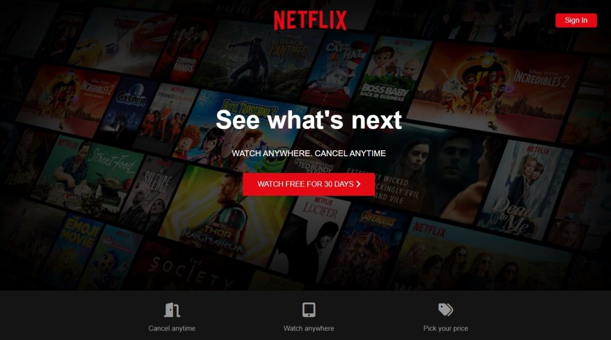
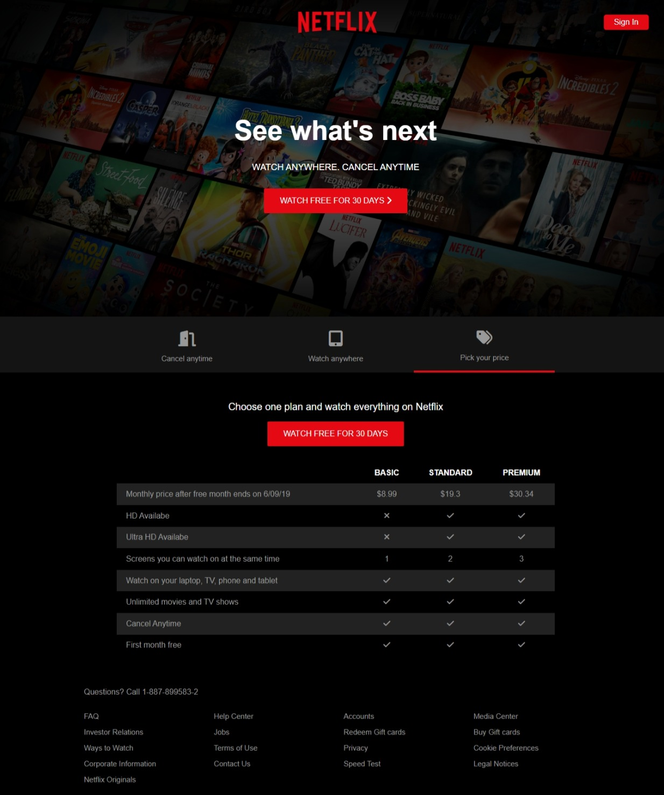
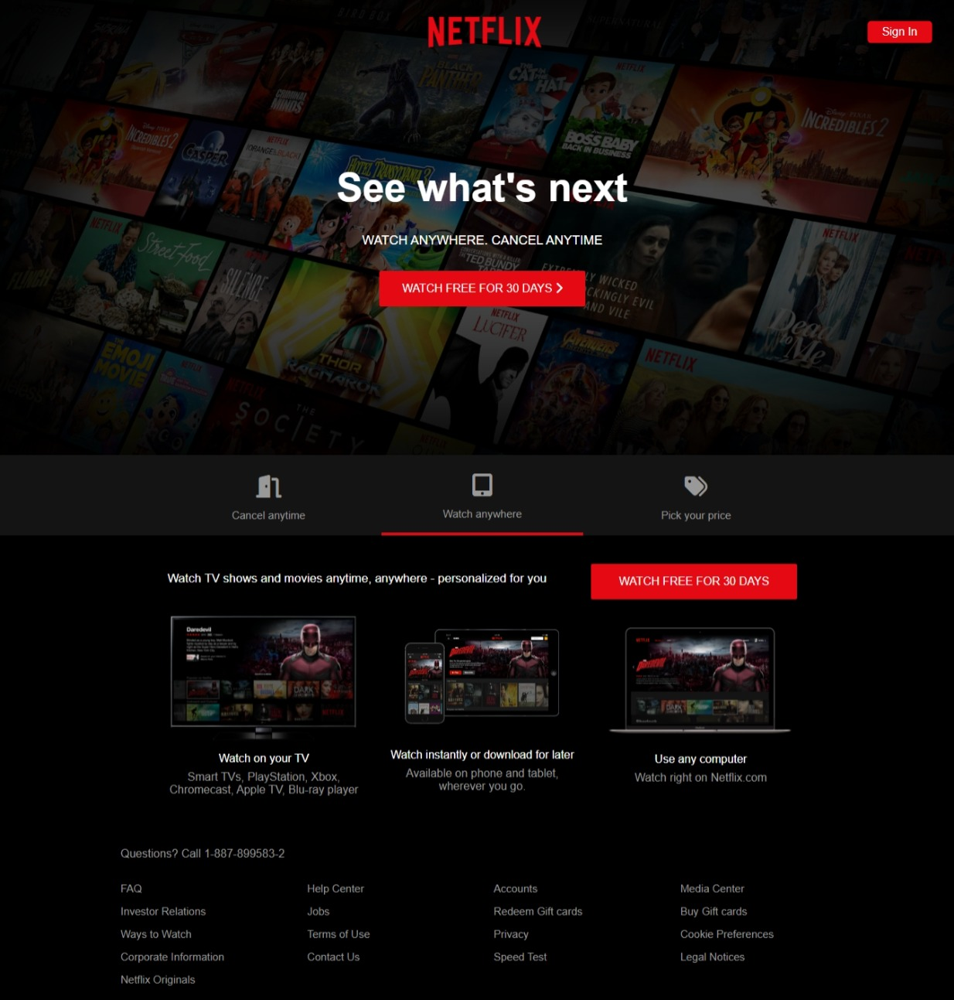
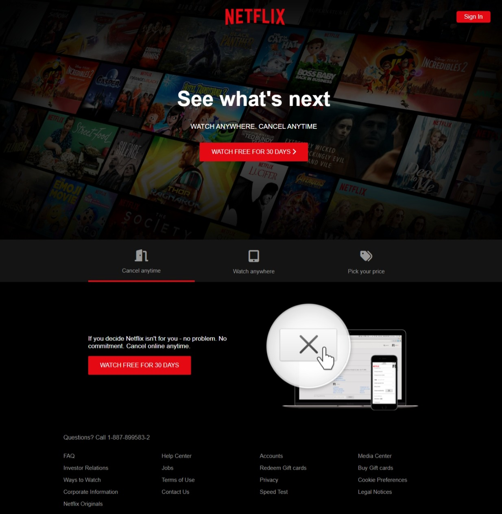
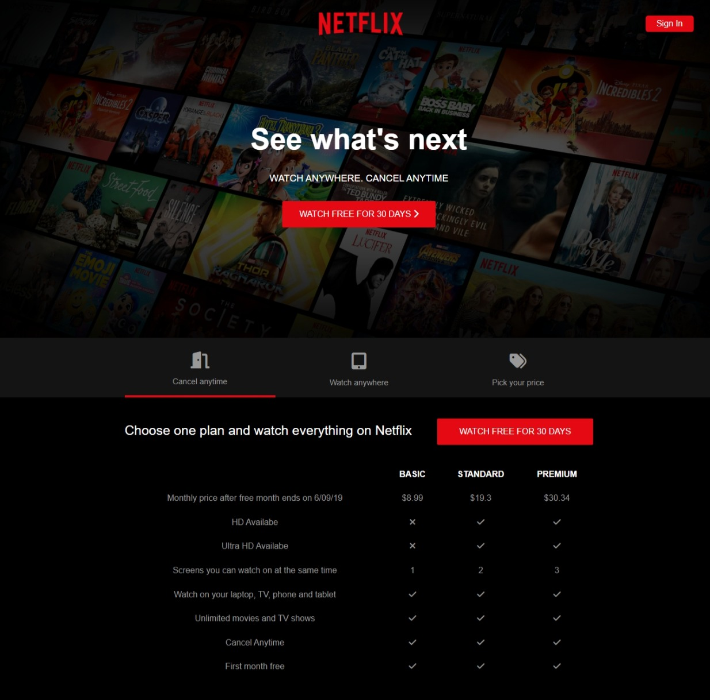
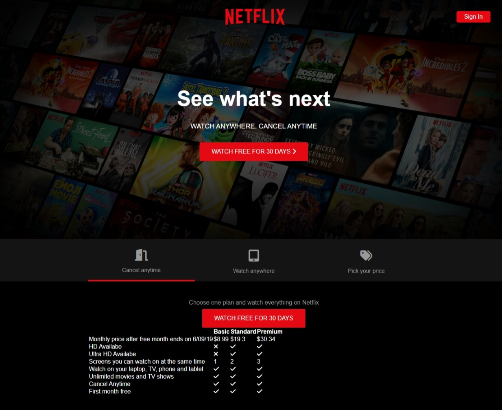
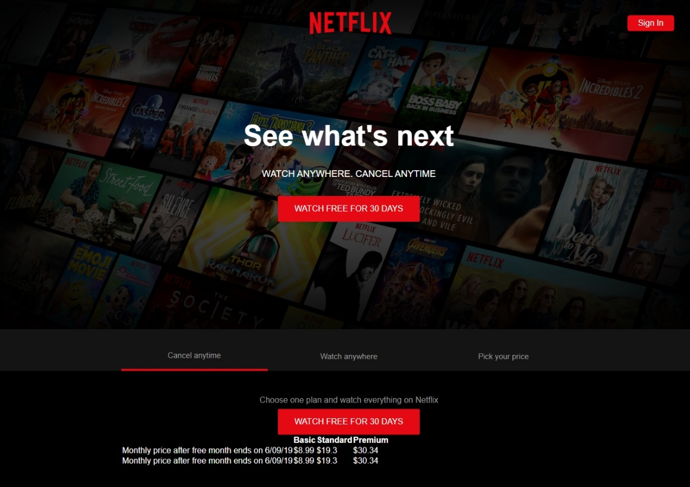

# Netflix-Landing-Page-Clone
Building a clone landing page of Netflix website using HTML, CSS and JavaScript

Netflix Clone Landing Page

## Overview
This project is a clone of the Netflix landing page, built using HTML, CSS, and JavaScript. The goal is to replicate the user interface and some key features of Netflix's website.

## Features
Responsive Design: The landing page is designed to be responsive and works well on different screen sizes.

Navigation Tabs: Includes tabs for different sections like "Movies," "TV Shows," and "Originals."

Interactive Elements: Features interactive elements such as buttons and accordions for FAQs.

Styling: Styled with CSS to closely match the look and feel of the Netflix website.

## Technologies Used
HTML: Used to structure the content of the webpage.

CSS: Used for styling and layout.

JavaScript: Used to add interactivity and dynamic content.

## Setup
Clone the repository:

git clone https://github.com/MC-CLINT/Netflix-Landing-Page-Clone.git

Navigate to the project directory:

## Usage
Open index.html in a web browser to view the landing page.

Navigate through the different tabs to see the content.

## Screenshots

## Credit
Travesty Media on Youtube
Roadmap.sh